# VIRĀM — Bhraman Saathi: Database Design

**Project:** VIRĀM (Bhraman Saathi) — Smart India Hackathon 2026, PS 26204
**Document:** DATABASE DESIGN — FINALIZED FOR IMPLEMENTATION
**Phase:** 1 — Database/Domain Design (design only; implementation follows approval)
**Status history:** PENDING REVIEW → FINALIZED FOR IMPLEMENTATION (this revision)

---

## 0. Conventions and general rules

These conventions apply to every entity in this document.

- **DBMS:** PostgreSQL 16+. **ORM:** SQLAlchemy 2.x. **Migrations:** Alembic. Implementation happens only after this design is reviewed and approved.
- **Primary keys:** `uuid` with `DEFAULT gen_random_uuid()`. UUIDs avoid enumeration and merge cleanly across environments.
- **Money:** integer paise (`*_paise bigint CHECK (*_paise > 0)` for positive amounts) with `currency CHAR(3) NOT NULL DEFAULT 'INR'`. Floating point is never used for money.
- **Status/type columns:** `text` with `CHECK (... IN (...))` constraints instead of native `ENUM` types, so new states are simple migrations rather than type alterations.
- **Timestamps:** `created_at timestamptz NOT NULL DEFAULT now()` on every table; `updated_at` where rows mutate.
- **Foreign keys:** explicit, with deliberate `ON DELETE` behaviour (`CASCADE` only for true dependants such as itinerary rows and recommendation items; `RESTRICT` for anything with historical or financial meaning).
- **No blanket soft delete:** `deleted_at` is not sprinkled on every table. Lifecycle is expressed through status, visibility, verification status, and active/archived flags (§25). Operational/financial records are never destructively edited.
- **No hardcoded test location:** no state/city is special-cased in the schema. The fixed test location is application-layer configuration (`LocationProvider → FixedTestLocationProvider`).
- **Naming:** snake_case tables (plural), snake_case columns, `*_id` FKs, `*_paise` money, `*_at` timestamps, `*_on` dates.
- **Design-level DDL sketches** below are authoritative for intent (columns, constraints, relationships); exact Alembic migration code is produced in the implementation phase from these definitions.

---

## 1. Account, authentication and Traveller profile

### 1.1 `users` — account root

One row per account. `account_role` is the only account-level distinction.

```
users
  id              uuid PK DEFAULT gen_random_uuid()
  email           text NOT NULL UNIQUE            -- stored lowercased
  password_hash   text NOT NULL                   -- argon2id hash; never plaintext
  display_name    text NOT NULL
  account_role    text NOT NULL DEFAULT 'USER'
                  CHECK (account_role IN ('USER','ADMIN'))
  status          text NOT NULL DEFAULT 'ACTIVE'
                  CHECK (status IN ('ACTIVE','DEACTIVATED'))
  created_at      timestamptz NOT NULL DEFAULT now()
  updated_at      timestamptz NOT NULL DEFAULT now()
```

**Traveller login is represented exactly here:** a `users` row with `account_role = 'USER'`. Registration (email + password) creates the account **and** auto-provisions the linked `traveller_profiles` row in the same transaction — there is no separate "traveller account type" and no role flag to flip. Login issues a short-lived signed access token (JWT, stateless) plus a revocable refresh session (§1.2). Logout revokes the session row; `DEACTIVATED` accounts fail authentication.

### 1.2 `user_sessions` — refresh sessions

```
user_sessions
  id                   uuid PK DEFAULT gen_random_uuid()
  user_id              uuid NOT NULL FK -> users(id) ON DELETE CASCADE
  refresh_token_hash   text NOT NULL UNIQUE          -- sha-256 of token; raw token never stored
  expires_at           timestamptz NOT NULL
  revoked_at           timestamptz                   -- set on logout/rotation
  created_at           timestamptz NOT NULL DEFAULT now()
```

Enables logout everywhere, session revocation, and token rotation. Access tokens themselves are stateless and short-lived.

### 1.3 `traveller_profiles` — the default profile (1:1, auto-created)

```
traveller_profiles
  user_id       uuid PK FK -> users(id) ON DELETE CASCADE
  full_name     text
  avatar_url    text
  phone         text
  home_state_id uuid FK -> states(id)          -- nullable; convenience for discovery defaults
  bio           text
  updated_at    timestamptz NOT NULL DEFAULT now()
```

Every `USER` is a traveller by default; this profile personalises the core experience (display name, avatar, home region). It carries no capability by itself — capabilities come from `account_role` and optional provider profiles (§2, §6).

---

## 2. Roles and permissions

**FINAL MODEL**

```
User
├── account_role: USER | ADMIN
├── traveller_profiles        (1:1, auto-created at registration — the default capability set)
├── guide_profiles            (0..1, opt-in)
└── business_profiles         (0..N, opt-in)
```

Traveller, Guide and Business Owner are **not mutually exclusive**: one account may hold any combination (e.g., Traveller + Guide + Business Owner). `ADMIN` is the only separate account-level role.

**Permission rules (enforced at the API layer on every protected endpoint):**

1. **Authentication** — valid, non-revoked session.
2. **Account role** — `account_role = 'ADMIN'` gates all admin endpoints (verification, moderation, content administration, audit).
3. **Capability** — existence of an approved `guide_profiles`/`business_profiles` row gates provider actions; no role flag is involved.
4. **Ownership** — row-level checks: a provider manages only rows where the provider row's `user_id` matches; a traveller accesses only their own trips, bookings, favourites, preferences and recommendations.
5. **Booking condition** — `CONDITIONAL_BOOKING_ACCESS` data (§24) additionally requires the caller to own a booking in the required state.

**No `RoleAssignment` table.** The model above covers every stated requirement; a generic assignment table is rejected as unnecessary MVP complexity. Revisit trigger: only if the platform later needs time-boxed, multi-granular, or delegated permissions that `account_role` + profile existence cannot express.

---

## 3. GuideProfile

Guides are users with an opt-in provider profile. One guide profile per user.

```
guide_profiles
  id                uuid PK DEFAULT gen_random_uuid()
  user_id           uuid NOT NULL UNIQUE FK -> users(id) ON DELETE CASCADE
  public_name       text NOT NULL
  bio               text
  languages         text[] NOT NULL DEFAULT '{}'
  expertise         text[] NOT NULL DEFAULT '{}'
  areas_served      text[] NOT NULL DEFAULT '{}'
  city_id           uuid FK -> cities(id)
  day_rate_paise    bigint CHECK (day_rate_paise > 0)
  currency          CHAR(3) NOT NULL DEFAULT 'INR'
  status            text NOT NULL DEFAULT 'PENDING'
                    CHECK (status IN ('PENDING','APPROVED','REJECTED','SUSPENDED'))
  visibility        text NOT NULL DEFAULT 'PRIVATE'
                    CHECK (visibility IN ('PUBLIC','PRIVATE'))
  reviewed_by       uuid FK -> users(id)          -- admin; set on verification action
  reviewed_at       timestamptz
  review_note       text                          -- ADMIN_ONLY (§24)
  created_at        timestamptz NOT NULL DEFAULT now()
  updated_at        timestamptz NOT NULL DEFAULT now()
```

- **Private contact information lives on the user account, not here.** A guide's phone/email is the guide user's own contact data; it is never published via the guide profile. It is released to a traveller only through `CONDITIONAL_BOOKING_ACCESS` after a confirmed guide booking (§24). This removes the need for a separate guide-contacts table.
- Discovery surfaces only `status='APPROVED' AND visibility='PUBLIC'` rows (partial index, §26).
- Ratings: `guide_reviews` (§12); the profile keeps no denormalised rating columns in the MVP — averages are computed at read time over the typed review tables.

## 4. BusinessProfile

Business owners may register multiple businesses. This table powers both business discovery and the **Local Partners** wall (cafés, restaurants, craftspeople, homestays, local food, tours, experiences).

```
business_profiles
  id                uuid PK DEFAULT gen_random_uuid()
  user_id           uuid NOT NULL FK -> users(id)   -- owner; multiple businesses allowed
  name              text NOT NULL
  description       text
  category          text NOT NULL
                    CHECK (category IN ('CAFE','RESTAURANT','ARTISAN','HANDICRAFT','HOMESTAY',
                                        'FOOD','TOUR','EXPERIENCE','OTHER'))
  state_id          uuid NOT NULL FK -> states(id)
  city_id           uuid NOT NULL FK -> cities(id)
  place_id          uuid FK -> places(id)           -- optional association with a place
  services          text[] NOT NULL DEFAULT '{}'
  public_phone      text
  public_email      text
  public_address    text
  status            text NOT NULL DEFAULT 'PENDING'
                    CHECK (status IN ('PENDING','APPROVED','REJECTED','SUSPENDED'))
  visibility        text NOT NULL DEFAULT 'PRIVATE'
                    CHECK (visibility IN ('PUBLIC','PRIVATE'))
  private_phone_enc bytea                            -- encrypted at rest; CONDITIONAL_BOOKING_ACCESS (§24)
  reviewed_by       uuid FK -> users(id)
  reviewed_at       timestamptz
  review_note       text                              -- ADMIN_ONLY
  created_at        timestamptz NOT NULL DEFAULT now()
  updated_at        timestamptz NOT NULL DEFAULT now()
```

- Unlike guides, a business may advertise **public** contact channels; the optional `private_phone_enc` exists for cases where the owner wants a contact released only to customers with a confirmed interaction.
- MVP commerce scope: browsing/discovery and reviews. Bookable "experiences" beyond hotel/guide are a future extension (§28) — the schema above is deliberately sufficient for the discovery + visibility half of the future marketplace without pre-building marketplace tables.

## 5. Provider verification

Verification is **entity-level status**, not a generic verification framework — the simpler pattern explicitly preferred for the MVP.

- Applies to: `guide_profiles.status`, `business_profiles.status`.
- States: `PENDING → APPROVED | REJECTED`; `APPROVED → SUSPENDED → APPROVED` (suspension is reversible).
- Each profile row retains **who** reviewed (`reviewed_by`), **when** (`reviewed_at`), and **why** (`review_note`) for the latest decision; every decision is additionally recorded in `admin_audit_log` (§23) so full history survives later status changes.
- Effects: only `APPROVED` providers appear in discovery; `SUSPENDED` providers are hidden from discovery but keep their historical bookings and reviews intact (§25).
- Hotels are admin-managed in the MVP (§6) and therefore carry a simpler `status` (§15) without traveller-facing verification workflow.

## 6. Ownership model

| Entity | Owner | How enforced |
|---|---|---|
| Trips, itineraries, favourites, preferences, recommendations | the traveller (`user_id` on each row) | row-level ownership checks |
| Hotel bookings, guide bookings, payments | the traveller (`user_id` on each row) | row-level ownership checks |
| GuideProfile | the guide user (`user_id UNIQUE`) | provider CRUD restricted to owner |
| BusinessProfile | the business owner (`user_id`, 1:N) | provider CRUD restricted to owner |
| Hotels, room types | **no user owner — admin-managed in MVP** | admin-only endpoints + audit log |
| Cultural content, places, categories, emergency data | admin-curated | admin-only endpoints + audit log |

**FINAL DECISION (summary; full rationale in Final Decisions):** hotels are admin-managed in the MVP because no hotel partner onboarding flow exists yet; the schema keeps `hotels` ownerless now and can add a nullable `user_id` + the standard verification columns later without breaking anything.

---

## 7. Geography: State, City, Place, PlaceCategory

Discovery hierarchy: `State → City → Place`, typed by `place_categories`.

```
states
  id          uuid PK DEFAULT gen_random_uuid()
  name        text NOT NULL UNIQUE
  slug        text NOT NULL UNIQUE

cities
  id          uuid PK DEFAULT gen_random_uuid()
  state_id    uuid NOT NULL FK -> states(id)
  name        text NOT NULL
  slug        text NOT NULL
  latitude    numeric(9,6) NOT NULL
  longitude   numeric(9,6) NOT NULL
  UNIQUE (state_id, name)
  UNIQUE (state_id, slug)

place_categories
  id          uuid PK DEFAULT gen_random_uuid()
  name        text NOT NULL UNIQUE            -- e.g. Heritage, Nature, Beach, Museum, Adventure
  slug        text NOT NULL UNIQUE

places
  id                      uuid PK DEFAULT gen_random_uuid()
  city_id                 uuid NOT NULL FK -> cities(id)
  category_id             uuid NOT NULL FK -> place_categories(id)
  name                    text NOT NULL
  slug                    text NOT NULL
  description             text NOT NULL
  latitude                numeric(9,6) NOT NULL
  longitude               numeric(9,6) NOT NULL
  classification          text NOT NULL DEFAULT 'POPULAR'
                          CHECK (classification IN ('POPULAR','LESSER_KNOWN'))
  lesser_known_note       text
                          CHECK (classification <> 'LESSER_KNOWN' OR lesser_known_note IS NOT NULL)
  popularity_score        numeric(5,2) CHECK (popularity_score BETWEEN 0 AND 100)
  rating_avg              numeric(2,1) CHECK (rating_avg BETWEEN 0 AND 5)
  review_count            integer NOT NULL DEFAULT 0 CHECK (review_count >= 0)
  typical_visit_minutes   integer CHECK (typical_visit_minutes > 0)
  opening_hours           text
  status                  text NOT NULL DEFAULT 'ACTIVE'
                          CHECK (status IN ('ACTIVE','ARCHIVED'))
  created_at              timestamptz NOT NULL DEFAULT now()
  updated_at              timestamptz NOT NULL DEFAULT now()
  UNIQUE (city_id, slug)
```

- **Lesser-known places are editorial, never generated.** The CHECK constraint forces a human-written `lesser_known_note` citing the documented/verified basis (e.g., state-tourism listing, editorial curation, community suggestion approved by an admin) whenever `classification = 'LESSER_KNOWN'`. No field, flag, or table in this design lets an AI or random process invent lesser-known status; classification changes are admin actions recorded in the audit log.
- `rating_avg`/`review_count` are maintained by the application when reviews are published (§12) — denormalised read models, recomputable from `place_reviews`.
- Seeds (states, cities, places) are data, not schema: the fixed test location lives entirely in application config (§0).

## 8. CulturalContent

Structured local knowledge beyond attractions: traditions, rituals, festivals, fairs, food, crafts, history, communities, cultural practices, local experiences.

```
cultural_content
  id              uuid PK DEFAULT gen_random_uuid()
  content_type    text NOT NULL
                  CHECK (content_type IN ('RITUAL','TRADITION','FESTIVAL','FAIR','FOOD','CRAFT',
                                          'HISTORY','COMMUNITY','PRACTICE','EXPERIENCE'))
  title           text NOT NULL
  body            text NOT NULL
  state_id        uuid FK -> states(id)
  city_id         uuid FK -> cities(id)
  place_id        uuid FK -> places(id)
                  CHECK (num_non_nulls(state_id, city_id, place_id) = 1)  -- exactly one level
  source          text NOT NULL DEFAULT 'EDITORIAL'
                  CHECK (source IN ('EDITORIAL','COMMUNITY'))
  status          text NOT NULL DEFAULT 'DRAFT'
                  CHECK (status IN ('DRAFT','PUBLISHED','ARCHIVED'))
  created_by      uuid FK -> users(id)            -- admin/editorial author
  created_at      timestamptz NOT NULL DEFAULT now()
  updated_at      timestamptz NOT NULL DEFAULT now()
```

- **A content record belongs to exactly one geographic level** (state **or** city **or** place) — enforced by the `num_non_nulls` CHECK, never simultaneously multiple levels.
- Only `status='PUBLISHED'` rows are publicly visible; `DRAFT` is a work state, `ARCHIVED` hides without deleting history.
- `source='COMMUNITY'` rows originate from an approved `community_suggestions` record (§22); the suggestion row keeps `derived_cultural_content_id` as the provenance link.

## 9. MediaAsset

One polymorphic media table with a **typed subject discriminator**.

```
media_assets
  id              uuid PK DEFAULT gen_random_uuid()
  subject_type    text NOT NULL
                  CHECK (subject_type IN ('PLACE','STATE','CITY','CULTURAL_CONTENT','GUIDE_PROFILE',
                                          'BUSINESS_PROFILE','HOTEL','REVIEW'))
  subject_id      uuid NOT NULL
  media_type      text NOT NULL DEFAULT 'IMAGE'
                  CHECK (media_type IN ('IMAGE','VIDEO','AUDIO'))
  url             text NOT NULL                    -- object-storage URL; no binaries in the DB
  alt_text        text
  is_cover        boolean NOT NULL DEFAULT false
  uploaded_by     uuid FK -> users(id)
  status          text NOT NULL DEFAULT 'ACTIVE'
                  CHECK (status IN ('ACTIVE','REMOVED'))
  created_at      timestamptz NOT NULL DEFAULT now()
```

- Images live in object storage (S3-compatible); the DB stores URLs and metadata only.
- Integrity trade-off (documented, accepted): no DB-level FK from `subject_id` — the application enforces existence and cascades by `(subject_type, subject_id)`. Chosen over eight near-identical per-subject media tables; revisited if any subject needs media-specific columns.

## 10. User preferences

Persistent personalisation plus reproducible per-trip snapshots.

```
user_preferences
  user_id        uuid PK FK -> users(id) ON DELETE CASCADE
  interests      text[] NOT NULL DEFAULT '{}'     -- Nature, Heritage, City life, Food, Craft, Culture,
                                                  -- Adventure, Relaxation, Local experiences, Festivals
  pace           text CHECK (pace IN ('RELAXED','BALANCED','PACKED'))
  budget_level   text CHECK (budget_level IN ('BUDGET','MID','PREMIUM'))
  notes          text
  updated_at     timestamptz NOT NULL DEFAULT now()
```

- **Preference snapshots for reproducibility:** every `trips` row stores `preferences_snapshot JSONB` (copy of the traveller's effective preferences at trip creation), and every persisted `recommendation_runs` row stores its own snapshot (§13). Later preference edits never retroactively change what a past recommendation was based on.
- Interest vocabularies are data (maintained by admins), not schema enums.

## 11. Favorites

```
favourite_places
  user_id      uuid NOT NULL FK -> users(id) ON DELETE CASCADE
  place_id     uuid NOT NULL FK -> places(id) ON DELETE CASCADE
  created_at   timestamptz NOT NULL DEFAULT now()
  PRIMARY KEY (user_id, place_id)               -- duplicates impossible
```

`AUTHENTICATED`/`OWNER_ONLY` data (§24). Un-favouriting deletes the row; the relationship itself is not historical data.

## 12. Reviews — four typed tables

Separate typed review entities (no polymorphic reviews), per the domain model.

```
place_reviews
  id           uuid PK DEFAULT gen_random_uuid()
  place_id     uuid NOT NULL FK -> places(id)
  author_id    uuid NOT NULL FK -> users(id)
  rating       smallint NOT NULL CHECK (rating BETWEEN 1 AND 5)
  text         text
  status       text NOT NULL DEFAULT 'PUBLISHED'
               CHECK (status IN ('PUBLISHED','HIDDEN','REMOVED'))
  created_at   timestamptz NOT NULL DEFAULT now()
  updated_at   timestamptz NOT NULL DEFAULT now()
  UNIQUE (place_id, author_id)                  -- one review per traveller per place

guide_reviews
  id                    uuid PK DEFAULT gen_random_uuid()
  guide_profile_id      uuid NOT NULL FK -> guide_profiles(id)
  guide_booking_id      uuid NOT NULL UNIQUE FK -> guide_bookings(id)  -- completed booking required
  author_id             uuid NOT NULL FK -> users(id)
  rating                smallint NOT NULL CHECK (rating BETWEEN 1 AND 5)
  text                  text
  status                text NOT NULL DEFAULT 'PUBLISHED'
                        CHECK (status IN ('PUBLISHED','HIDDEN','REMOVED'))
  created_at            timestamptz NOT NULL DEFAULT now()
  updated_at            timestamptz NOT NULL DEFAULT now()
  UNIQUE (guide_profile_id, author_id)

hotel_reviews
  id                    uuid PK DEFAULT gen_random_uuid()
  hotel_id              uuid NOT NULL FK -> hotels(id)
  hotel_booking_id      uuid NOT NULL UNIQUE FK -> hotel_bookings(id)  -- completed booking required
  author_id             uuid NOT NULL FK -> users(id)
  rating                smallint NOT NULL CHECK (rating BETWEEN 1 AND 5)
  text                  text
  status                text NOT NULL DEFAULT 'PUBLISHED'
                        CHECK (status IN ('PUBLISHED','HIDDEN','REMOVED'))
  created_at            timestamptz NOT NULL DEFAULT now()
  updated_at            timestamptz NOT NULL DEFAULT now()
  UNIQUE (hotel_id, author_id)

business_reviews
  id                  uuid PK DEFAULT gen_random_uuid()
  business_profile_id uuid NOT NULL FK -> business_profiles(id)
  author_id           uuid NOT NULL FK -> users(id)
  rating              smallint NOT NULL CHECK (rating BETWEEN 1 AND 5)
  text                text
  status              text NOT NULL DEFAULT 'PUBLISHED'
                      CHECK (status IN ('PUBLISHED','HIDDEN','REMOVED'))
  created_at          timestamptz NOT NULL DEFAULT now()
  updated_at          timestamptz NOT NULL DEFAULT now()
  UNIQUE (business_profile_id, author_id)
```

- **Eligibility:** guide and hotel reviews carry a **NOT NULL, UNIQUE FK to their completed booking** — a traveller can review only a service they booked — at most one review per traveller per target, pinned by the booking FK to the booking that earned it. Place and business reviews require only an authenticated author.
- Moderation: `HIDDEN`/`REMOVED` by admin action (audit-logged); rows are never deleted, preserving history (§25). Hidden rows drop out of `rating_avg`/`review_count` recomputation.
- Duplicate prevention: per-entity `(target, author)` UNIQUE constraints.

## 13. RecommendationRun and RecommendationItem

Hybrid persistence with a replaceable engine.

```
recommendation_runs
  id                    uuid PK DEFAULT gen_random_uuid()
  user_id               uuid NOT NULL FK -> users(id)
  trip_id               uuid FK -> trips(id)    -- NULL for unsaved planning sessions
  engine_name           text NOT NULL DEFAULT 'RuleBasedRecommendationEngine'
  engine_version        text NOT NULL           -- e.g. 'rules-v1'
  preference_snapshot   JSONB NOT NULL          -- inputs the engine actually used
  created_at            timestamptz NOT NULL DEFAULT now()

recommendation_items
  id                 uuid PK DEFAULT gen_random_uuid()
  run_id             uuid NOT NULL FK -> recommendation_runs(id) ON DELETE CASCADE
  place_id           uuid NOT NULL FK -> places(id)
  rank               integer NOT NULL CHECK (rank >= 1)
  score              numeric(6,2)
  classification     text NOT NULL
                     CHECK (classification IN ('POPULAR','LESSER_KNOWN'))
  explanation        text NOT NULL               -- human-readable rationale, e.g.
                                                 -- "Matches heritage + food interests; 4.6 rating"
  accepted           boolean NOT NULL DEFAULT false
  created_at         timestamptz NOT NULL DEFAULT now()
```

- **Transient vs persistent:** casual browsing recommendations stay transient (served, never written). A run is persisted only when the traveller saves it to a trip or accepts items from it. `trip_id` may be temporarily NULL until the trip is created/linked.
- **Anonymous browsing is never persisted** — no runs without an authenticated user.
- **Engine replaceability:** `engine_name` + `engine_version` record what produced each run (`RecommendationEngine → RuleBasedRecommendationEngine → future AIRecommendationEngine`). Any engine writes the same run/item shape; a future AI engine needs zero schema changes.
- Itinerary items reference `recommendation_items.id` for provenance (§14) — selected recommendations remain traceable to the run that produced them.

---

## 14. Trip, Itinerary, ItineraryDay, ItineraryItem

Planning aggregate. For the MVP one active itinerary per trip; recommendations are accepted/modified into the itinerary before booking.

```
trips
  id                    uuid PK DEFAULT gen_random_uuid()
  user_id               uuid NOT NULL FK -> users(id)
  city_id               uuid NOT NULL FK -> cities(id)
  starts_on             date NOT NULL
  ends_on               date NOT NULL
  party_size            integer NOT NULL DEFAULT 1 CHECK (party_size BETWEEN 1 AND 50)
  status                text NOT NULL DEFAULT 'PLANNING'
                        CHECK (status IN ('PLANNING','BOOKED','CONFIRMED','COMPLETED','CANCELLED'))
  preferences_snapshot  JSONB NOT NULL DEFAULT '{}'      -- §10; reproducibility
  created_at            timestamptz NOT NULL DEFAULT now()
  updated_at            timestamptz NOT NULL DEFAULT now()
  CHECK (ends_on >= starts_on)

itineraries
  id          uuid PK DEFAULT gen_random_uuid()
  trip_id     uuid NOT NULL UNIQUE FK -> trips(id) ON DELETE CASCADE   -- one active itinerary per trip (MVP)
  status      text NOT NULL DEFAULT 'ACTIVE'
              CHECK (status IN ('ACTIVE','SUPERSEDED'))
  created_at  timestamptz NOT NULL DEFAULT now()
```

```
itinerary_days
  id            uuid PK DEFAULT gen_random_uuid()
  itinerary_id  uuid NOT NULL FK -> itineraries(id) ON DELETE CASCADE
  day_number    smallint NOT NULL CHECK (day_number >= 1)
  date          date NOT NULL
  note          text
  UNIQUE (itinerary_id, day_number)
```

```
itinerary_items
  id                       uuid PK DEFAULT gen_random_uuid()
  itinerary_day_id         uuid NOT NULL FK -> itinerary_days(id) ON DELETE CASCADE
  position                 smallint NOT NULL CHECK (position >= 0)
  place_id                 uuid FK -> places(id)
  custom_title             text
                           CHECK (place_id IS NOT NULL OR custom_title IS NOT NULL)  -- at least one
  recommendation_item_id   uuid FK -> recommendation_items(id)     -- provenance, nullable
  start_time               time
  duration_minutes         integer CHECK (duration_minutes > 0)
  note                     text
  created_at               timestamptz NOT NULL DEFAULT now()
  UNIQUE (itinerary_day_id, position)
```

- `ends_on >= starts_on` allows a same-day trip; day generation derives from the date range.
- A same-day trip with a multi-day itinerary is prevented application-side (days count derived from dates); the schema's UNIQUE constraints catch duplicates.
- `itineraries.status SUPERSEDED` exists so a future multi-itinerary revision model (versioning) can arrive by adding `version` — no rework of trips/days/items.
- Trip status flow: `PLANNING → BOOKED → CONFIRMED → COMPLETED | CANCELLED`, derived from its bookings' states by the application.

---

## 15. Hotel, RoomType, HotelBooking

Hotels are **admin-managed in the MVP** (§6). Booking is request-based; the MVP never pretends real-time inventory exists.

```
hotels
  id              uuid PK DEFAULT gen_random_uuid()
  city_id         uuid NOT NULL FK -> cities(id)
  name            text NOT NULL
  slug            text NOT NULL
  description     text
  latitude        numeric(9,6)
  longitude       numeric(9,6)
  amenities       text[] NOT NULL DEFAULT '{}'
  public_phone    text
  public_email    text
  public_address  text
  status          text NOT NULL DEFAULT 'ACTIVE'
                  CHECK (status IN ('ACTIVE','INACTIVE'))
  created_at      timestamptz NOT NULL DEFAULT now()
  updated_at      timestamptz NOT NULL DEFAULT now()
  UNIQUE (city_id, slug)

room_types
  id                 uuid PK DEFAULT gen_random_uuid()
  hotel_id           uuid NOT NULL FK -> hotels(id)
  name               text NOT NULL               -- e.g. Deluxe Double
  capacity           integer NOT NULL CHECK (capacity BETWEEN 1 AND 10)
  nightly_rate_paise bigint NOT NULL CHECK (nightly_rate_paise > 0)
  currency           CHAR(3) NOT NULL DEFAULT 'INR'
  declared_units     integer                     -- informational only; NOT live availability
  created_at         timestamptz NOT NULL DEFAULT now()
  updated_at         timestamptz NOT NULL DEFAULT now()
  UNIQUE (hotel_id, name)

hotel_bookings
  id                uuid PK DEFAULT gen_random_uuid()
  reference_id      text NOT NULL UNIQUE         -- human-readable, e.g. VIR-HB-XXXXXX
  user_id           uuid NOT NULL FK -> users(id)
  trip_id           uuid FK -> trips(id)
  hotel_id          uuid NOT NULL FK -> hotels(id)
  room_type_id      uuid NOT NULL FK -> room_types(id)
  check_in_date     date NOT NULL
  check_out_date    date NOT NULL
  rooms_count       integer NOT NULL DEFAULT 1 CHECK (rooms_count >= 1)
  price_snapshot_paise bigint NOT NULL CHECK (price_snapshot_paise > 0)
  currency          CHAR(3) NOT NULL DEFAULT 'INR'
  status            text NOT NULL DEFAULT 'PENDING_PAYMENT'
                    CHECK (status IN ('PENDING_PAYMENT','CONFIRMED','CANCELLED','COMPLETED','REFUNDED'))
  cancelled_at      timestamptz
  cancellation_reason text
  external_reference text                        -- future OTA/partner reference
  created_at        timestamptz NOT NULL DEFAULT now()
  updated_at        timestamptz NOT NULL DEFAULT now()
  CHECK (check_out_date > check_in_date)
```

- **No per-night inventory table.** The MVP has no live provider integration, so no `hotel_inventory` exists; the platform does **not** claim real-time room availability. Booking is a request/confirmation flow with server-side pricing from `room_types`.
- `price_snapshot_paise` freezes the agreed price at booking time; later `room_types.nightly_rate_paise` changes never rewrite history (§25).
- Private hotel contact details (owner/manager phone, internal address notes) are **not stored in the MVP** — hotels are admin-onboarded and publish public contact channels. If private hotel contacts are introduced later, they arrive as an encrypted-contact table with `CONDITIONAL_BOOKING_ACCESS` semantics mirroring `business_profiles.private_phone_enc` (§24).

## 16. Guide, GuideAvailability, GuideBooking

```
guide_availability
  guide_profile_id  uuid NOT NULL FK -> guide_profiles(id) ON DELETE CASCADE
  service_date      date NOT NULL
  status            text NOT NULL DEFAULT 'AVAILABLE'
                    CHECK (status IN ('AVAILABLE','UNAVAILABLE','BUSY'))
  note              text
  PRIMARY KEY (guide_profile_id, service_date)
```

- **Self-declared availability:** the guide marks real dates available or unavailable. There is no fictional auto-generation of slots. Dates with no row are treated as *not offered* by the application (an explicit row is required to offer a date), avoiding the legacy trap where unmarked dates defaulted to bookable.

```
guide_bookings
  id                  uuid PK DEFAULT gen_random_uuid()
  reference_id        text NOT NULL UNIQUE        -- e.g. VIR-GB-XXXXXX
  user_id             uuid NOT NULL FK -> users(id)
  trip_id             uuid FK -> trips(id)
  guide_profile_id    uuid NOT NULL FK -> guide_profiles(id)
  service_start_date  date NOT NULL
  service_end_date    date NOT NULL               -- single-day bookings use start = end
  price_snapshot_paise bigint NOT NULL CHECK (price_snapshot_paise > 0)
  currency            CHAR(3) NOT NULL DEFAULT 'INR'
  status              text NOT NULL DEFAULT 'PENDING_PAYMENT'
                      CHECK (status IN ('PENDING_PAYMENT','CONFIRMED','CANCELLED','COMPLETED','REFUNDED'))
  cancelled_at        timestamptz
  cancellation_reason text
  created_at          timestamptz NOT NULL DEFAULT now()
  updated_at          timestamptz NOT NULL DEFAULT now()
  CHECK (service_end_date >= service_start_date)
```

- Hotel and guide bookings are **separate typed tables** (no generic polymorphic booking). They share the same status vocabulary and reference format, which keeps trip-dashboard aggregation trivial while making each domain's rules explicit.
- Availability conflict checks and status transitions are application-layer transactional logic (booking dates vs `guide_availability`, existing bookings on those dates).

## 17. Local businesses and experiences

- Discovery and detail for businesses run on `business_profiles` (§4) with `media_assets` galleries and `business_reviews`.
- The **Local Partners** wall is a filtered presentation over approved, public business profiles by `category` — a query, not a table.
- **Experiences** are represented in the MVP as business profiles of category `EXPERIENCE`/`TOUR` (with `services` arrays describing offerings). Dedicated experience bookable services (slots, capacities, per-experience pricing) are a **future** extension (§28); booking them is intentionally out of MVP scope.

---

## 18. Payments and gateway integration

One checkout pays for one or both typed bookings of a trip.

```
payments
  id                 uuid PK DEFAULT gen_random_uuid()
  user_id            uuid NOT NULL FK -> users(id)
  hotel_booking_id   uuid FK -> hotel_bookings(id)
  guide_booking_id   uuid FK -> guide_bookings(id)
                     CHECK (hotel_booking_id IS NOT NULL OR guide_booking_id IS NOT NULL)  -- at least one
  gateway            text NOT NULL                              -- e.g. 'RAZORPAY'
  gateway_order_id   text NOT NULL UNIQUE
  gateway_payment_id text UNIQUE
  amount_paise       bigint NOT NULL CHECK (amount_paise > 0)
  currency           CHAR(3) NOT NULL DEFAULT 'INR'
  status             text NOT NULL DEFAULT 'CREATED'
                     CHECK (status IN ('CREATED','PENDING','SUCCEEDED','FAILED','REFUNDED'))
  idempotency_key    text NOT NULL UNIQUE
  created_at         timestamptz NOT NULL DEFAULT now()
  paid_at            timestamptz

refunds
  id                uuid PK DEFAULT gen_random_uuid()
  payment_id        uuid NOT NULL FK -> payments(id)
  amount_paise      bigint NOT NULL CHECK (amount_paise > 0)
  currency          CHAR(3) NOT NULL DEFAULT 'INR'
  gateway_refund_id text NOT NULL UNIQUE
  reason            text
  status            text NOT NULL DEFAULT 'REQUESTED'
                    CHECK (status IN ('REQUESTED','PROCESSING','PROCESSED','FAILED'))
  created_at        timestamptz NOT NULL DEFAULT now()
  processed_at      timestamptz

payment_webhook_events
  provider      text NOT NULL
  event_id      text NOT NULL
  payload       JSONB                                          -- raw event body for replay/debug
  received_at   timestamptz NOT NULL DEFAULT now()
  processed_at  timestamptz
  PRIMARY KEY (provider, event_id)                             -- replay-safe idempotency
```

- **Never stored, under any circumstances:** card numbers, CVV, UPI PIN, raw banking credentials, payment passwords. The schema physically contains no columns for them — only gateway identifiers, amounts, currencies, statuses, keys and timestamps (the safe-metadata list required by the project).
- **A payment links to its bookings directly** via `hotel_booking_id` / `guide_booking_id` with an at-least-one CHECK; a single checkout covering both a hotel and a guide booking is one `payments` row with both FKs set. This replaces both a generic booking table and a payment-items join table — two typed FKs are the simpler, fully-constrained equivalent.
- **The gateway webhook is authoritative** for final payment state; the browser redirect is informational only. `(provider, event_id)` deduplication makes webhook replays harmless; payloads are retained for replay and debugging.
- Server-side pricing only: amounts are computed from `room_types` / guide rates and frozen into booking price snapshots — client-supplied totals are never trusted.
- `payments.status` transitions drive booking status transitions (`PENDING_PAYMENT → CONFIRMED` on `SUCCEEDED`) in the same transaction; failures/cancellations leave typed bookings cancelled rather than deleted (§25).

## 19. TripLocation and RouteSnapshot

```
trip_locations
  id              uuid PK DEFAULT gen_random_uuid()
  trip_id         uuid NOT NULL FK -> trips(id) ON DELETE CASCADE
  kind            text NOT NULL
                  CHECK (kind IN ('PLACE','HOTEL','BUSINESS','CUSTOM'))
  place_id        uuid FK -> places(id)
  hotel_id        uuid FK -> hotels(id)
  business_id     uuid FK -> business_profiles(id)
  custom_name     text
  latitude        numeric(9,6)
  longitude      numeric(9,6)
                  CHECK (
                    (kind = 'PLACE'    AND place_id IS NOT NULL AND hotel_id IS NULL AND business_id IS NULL)
                 OR (kind = 'HOTEL'    AND hotel_id IS NOT NULL AND place_id IS NULL AND business_id IS NULL)
                 OR (kind = 'BUSINESS' AND business_id IS NOT NULL AND place_id IS NULL AND hotel_id IS NULL)
                 OR (kind = 'CUSTOM'   AND place_id IS NULL AND hotel_id IS NULL AND business_id IS NULL
                                      AND custom_name IS NOT NULL AND latitude IS NOT NULL AND longitude IS NOT NULL)
                  )

route_snapshots
  id                uuid PK DEFAULT gen_random_uuid()
  trip_id           uuid NOT NULL FK -> trips(id) ON DELETE CASCADE
  origin_id         uuid NOT NULL FK -> trip_locations(id) ON DELETE CASCADE
  destination_id    uuid NOT NULL FK -> trip_locations(id) ON DELETE CASCADE
  provider          text NOT NULL                              -- e.g. 'MAPS_PROVIDER'
  distance_km       numeric(8,2) CHECK (distance_km >= 0)
  duration_minutes  integer CHECK (duration_minutes >= 0)
  polyline          text
  fetched_at        timestamptz NOT NULL DEFAULT now()
  CHECK (origin_id <> destination_id)
```

- `trip_locations` normalises the four kinds of waypoints a route can contain, with kind-consistency enforced by CHECK (this mirrors the checked-union pattern used deliberately here and for payments — typed, constrained alternatives instead of unconstrained polymorphism).
- Route snapshots are **caches**: the MVP does not store live routing history forever; stale rows are cleaned up by TTL (§25), and the UI shows the retrieval timestamp.

## 20. WeatherSnapshot

```
weather_snapshots
  id             uuid PK DEFAULT gen_random_uuid()
  city_id        uuid NOT NULL FK -> cities(id)
  forecast_date  date NOT NULL
  provider       text NOT NULL
  fetched_at     timestamptz NOT NULL DEFAULT now()
  temp_min_c     numeric(4,1)
  temp_max_c     numeric(4,1)
  condition      text
  details        JSONB
  UNIQUE (city_id, forecast_date, provider, fetched_at)
```

- Weather is a **snapshot/cache, never permanent truth**; multiple fetches coexist (UNIQUE includes `fetched_at`), the UI uses the freshest row per `(city_id, forecast_date)`.
- Future weather-aware itinerary adaptation reads these snapshots; nothing about the engine is baked into the schema. TTL cleanup applies (§25).

## 21. EmergencyFacility and EmergencyContact

```
emergency_facilities
  id           uuid PK DEFAULT gen_random_uuid()
  city_id      uuid NOT NULL FK -> cities(id)
  name         text NOT NULL
  kind         text NOT NULL
               CHECK (kind IN ('HOSPITAL','CLINIC','PHARMACY'))
  latitude     numeric(9,6) NOT NULL
  longitude    numeric(9,6) NOT NULL
  phone        text
  address      text
  source       text NOT NULL                                  -- verified govt/hospital source
  verified_at  timestamptz
  created_at   timestamptz NOT NULL DEFAULT now()

emergency_contacts
  id         uuid PK DEFAULT gen_random_uuid()
  scope      text NOT NULL
             CHECK (scope IN ('NATIONAL','STATE','CITY'))
  state_id   uuid FK -> states(id)        -- required when scope='STATE'
  city_id    uuid FK -> cities(id)        -- required when scope='CITY'
             CHECK (
               (scope = 'NATIONAL' AND state_id IS NULL AND city_id IS NULL)
            OR (scope = 'STATE'   AND state_id IS NOT NULL AND city_id IS NULL)
            OR (scope = 'CITY'    AND state_id IS NULL AND city_id IS NOT NULL)
             )
  label      text NOT NULL
  number     text NOT NULL
  created_at timestamptz NOT NULL DEFAULT now()
```

- Maintained **separately from traveller/community-generated content** — admin-curated, sourced, with verification timestamps.
- The national emergency number `112` is surfaced application-side alongside these records.

## 22. CommunitySuggestion

Local knowledge intake. Initial channel is a **Google Form**, imported by the team — the table records `source` so in-app submission can be added later without schema change.

```
community_suggestions
  id                        uuid PK DEFAULT gen_random_uuid()
  source                    text NOT NULL DEFAULT 'GOOGLE_FORM'
                            CHECK (source IN ('GOOGLE_FORM','IN_APP'))
  submitter_name            text NOT NULL
  submitter_contact         text
  suggestion_type           text NOT NULL
                            CHECK (suggestion_type IN ('RITUAL','TRADITION','TRIBE_COMMUNITY','FAIR_FESTIVAL',
                                                       'FOOD','CRAFT','LOCAL_HISTORY','LESSER_KNOWN_PLACE',
                                                       'CULTURAL_PRACTICE','LOCAL_EXPERIENCE'))
  payload                   JSONB NOT NULL            -- the submission content, structured by type
  state_id                  uuid FK -> states(id)     -- optional geographic hint
  city_id                   uuid FK -> cities(id)
  place_id                  uuid FK -> places(id)
  status                    text NOT NULL DEFAULT 'PENDING'
                            CHECK (status IN ('PENDING','APPROVED','REJECTED'))
  reviewed_by               uuid FK -> users(id)
  reviewed_at               timestamptz
  review_note               text                      -- ADMIN_ONLY
  derived_cultural_content_id uuid FK -> cultural_content(id)  -- provenance when approved
  created_at                timestamptz NOT NULL DEFAULT now()
  updated_at                timestamptz NOT NULL DEFAULT now()
```

- **Submissions are never auto-published.** Approval is a manual admin/team action; every decision records reviewer, timestamp and note, and is audit-logged.
- On approval, an admin creates a `cultural_content` row (source `COMMUNITY`); the suggestion keeps `derived_cultural_content_id` for provenance. Approval may also add a `LESSER_KNOWN` place — which then requires the editorial `lesser_known_note` (§7).
- `IN_APP` submission is a future capability (§28); the `source` enum already anticipates it.

## 23. AdminAuditLog

```
admin_audit_log
  id           uuid PK DEFAULT gen_random_uuid()
  admin_id     uuid NOT NULL FK -> users(id)
  action       text NOT NULL     -- e.g. 'GUIDE_VERIFIED', 'BUSINESS_SUSPENDED', 'SUGGESTION_REJECTED',
                                 -- 'PLACE_UPDATED', 'CONTENT_PUBLISHED', 'REVIEW_HIDDEN', 'CONTACT_ACCESSED'
  target_type  text NOT NULL
  target_id    uuid NOT NULL
  before       JSONB             -- prior state snapshot where applicable
  after        JSONB             -- new state snapshot where applicable
  reason       text
  created_at   timestamptz NOT NULL DEFAULT now()
```

- **Append-only**: no UPDATE, no DELETE. Every important administrative action (verification decisions, moderation, suspensions, content administration, suggestion decisions, and access to `CONDITIONAL_BOOKING_ACCESS` data) lands here.
- Historical preservation: because provider rows keep only their latest verification fields, this log is the durable history of every administrative decision (§25).

---

## 24. Security and data visibility

Five visibility levels are used across the design: `PUBLIC`, `AUTHENTICATED`, `OWNER_ONLY`, `CONDITIONAL_BOOKING_ACCESS`, `ADMIN_ONLY`.

**The core rule: login alone never reveals private provider contact information.** `CONDITIONAL_BOOKING_ACCESS` data is released only when the requester owns a booking whose status is `CONFIRMED` (payment verified) — and only for that booking's provider. Authentication, ownership, and booking-state checks are stacked; failing any one denies access. Every release of private contact data is audit-logged (`CONTACT_ACCESSED`).

**Visibility matrix:**

| Data | Level | Notes |
|---|---|---|
| States, cities, places, published cultural content, approved public guide/business profiles, public hotel info, emergency data | `PUBLIC` | browsable without login |
| Favourites, own preferences, own recommendation history | `AUTHENTICATED` + `OWNER_ONLY` | tied to the caller's user_id |
| Trips, itineraries, bookings, payments, personal profile | `OWNER_ONLY` | row ownership enforced server-side |
| Guide user's private phone/email (on `users`) | `CONDITIONAL_BOOKING_ACCESS` | released only after a CONFIRMED guide booking by the requester; audit-logged |
| `business_profiles.private_phone_enc` | `CONDITIONAL_BOOKING_ACCESS` | released only after a confirmed interaction per admin policy; audit-logged |
| `guide_profiles.review_note`, `business_profiles.review_note`, suggestion `review_note`, audit log, moderation data | `ADMIN_ONLY` | never exposed on public/owner endpoints |
| Encrypted-at-rest fields | `ADMIN_ONLY`/`CONDITIONAL_BOOKING_ACCESS` | `private_phone_enc` uses app-layer envelope encryption; keys in env, never in repo |

**Additional security requirements:** password hashing with argon2id; refresh-token hashes (not raw tokens) in `user_sessions`; short-lived JWT access tokens; parameterized ORM queries only; FK/UNIQUE/CHECK enforcement at the DB; rate limiting on auth, recommendation and checkout endpoints (implementation phase); no secrets committed — API keys, DB passwords, JWT secrets and encryption keys live in environment config only (see External API Dependencies).

## 25. Data lifecycle, status and archival

**No blanket `deleted_at`.** Each family of tables uses the lifecycle mechanism appropriate to it:

| Tables | Mechanism | Rule |
|---|---|---|
| `users` | `status ACTIVE/DEACTIVATED` | Deactivation over deletion; an account is **never hard-deleted** while it holds bookings/payments — FK integrity and financial history demand the row survives. Deactivated users fail login; admin redaction of profile fields is an audit-logged action. |
| Bookings (`hotel_bookings`, `guide_bookings`), `payments`, `refunds` | status transitions; **immutable after confirmation** | Financial/operational records are never destroyed or rewritten. Corrections happen via new rows (refunds, rebookings) — history preserved. Cancellation is a status, not a deletion. |
| Reviews | `status PUBLISHED/HIDDEN/REMOVED` | Rows never deleted; moderation hides. Averages recompute excluding non-published rows. |
| Hotels, room types | `status ACTIVE/INACTIVE` | Admin-managed; deactivation hides from discovery while booking/review history is preserved. |
| Emergency facilities/contacts | admin-curated, source-stamped | Corrections are admin updates (audit-logged); never mixed with traveller-generated content. |
| Places, cultural content | `status ACTIVE/ARCHIVED`, `DRAFT/PUBLISHED/ARCHIVED` | Archival hides from discovery while preserving references from past trips and suggestions. |
| Guide/business profiles | verification `status` + `visibility` | Suspension hides without destroying bookings/reviews history. |
| Guide availability | self-declared rows | Guides upsert/delete date rows; not historical data. |
| Community suggestions | `status PENDING/APPROVED/REJECTED` | Decisions retained with reviewer/note; rows never purged (provenance for derived content). |
| `admin_audit_log` | append-only | Never updated, never deleted. |
| `media_assets` | `status ACTIVE/REMOVED` | Storage objects removed by lifecycle jobs; URL rows retained/removed by policy. |
| `weather_snapshots`, `route_snapshots` | TTL cleanup | Caches expire; not historical records. A periodic job deletes rows older than the configured TTL. |
| `user_sessions` | `revoked_at` + expiry cleanup | Old sessions purged periodically. |
| Favourites | physical delete | Not historical data; unfavourite removes the row. |
| Recommendation runs/items | persisted only when saved/accepted; `ON DELETE CASCADE` with their trip/run | Transient by default; a trip's deletion removes its cascaded planning artefacts — bookings/payments are never cascaded away. |

## 26. Constraints and indexes

Constraints summary (normative for implementation; Alembic migrations must reproduce them):

- **Uniqueness:** `users.email`; `user_sessions.refresh_token_hash`; `traveller_profiles.user_id`; `guide_profiles.user_id`; `states.name`, `states.slug`; `cities (state_id,name)`, `(state_id,slug)`; `place_categories.name/slug`; `places (city_id,slug)`; `hotels (city_id,slug)`; `room_types (hotel_id,name)`; `favourite_places (user_id,place_id)`; `place_reviews (place_id,author_id)`; `guide_reviews (guide_profile_id,author_id)`, `guide_reviews.guide_booking_id UNIQUE`; `hotel_reviews (hotel_id,author_id)`, `hotel_reviews.hotel_booking_id UNIQUE`; `business_reviews (business_profile_id,author_id)`; `payments.gateway_order_id`, `payments.idempotency_key`, `payments.gateway_payment_id`; `refunds.gateway_refund_id`; `payment_webhook_events (provider,event_id)`; `hotel_bookings.reference_id`, `guide_bookings.reference_id`; `itineraries.trip_id`; `itinerary_days (itinerary_id,day_number)`; `itinerary_items (itinerary_day_id,position)`; `guide_availability (guide_profile_id,service_date)`.
- **CHECK constraints:** all money `> 0`; ratings `BETWEEN 1 AND 5`; `places.popularity_score BETWEEN 0 AND 100`; date ordering (`hotel_bookings`, `guide_bookings`, `trips`); `users.account_role`, all status/type discriminator CHECKs (§0); `places.lesser_known_note` required when `LESSER_KNOWN`; `cultural_content` exactly-one-of (`num_non_nulls(state_id,city_id,place_id)=1`); `itinerary_items` at-least-one-of (`place_id`/`custom_title`); `payments` at-least-one-of (`hotel_booking_id`/`guide_booking_id`); `trip_locations` kind-consistent FK pattern; `emergency_contacts` scope-consistent FKs; `route_snapshots` `origin_id <> destination_id`.
- **FK graph:** every FK listed in §1–§23; `ON DELETE CASCADE` only where dependants die with their parent (sessions, traveller profile, favourites, itineraries/days/items, recommendation runs/items, trip_locations, route_snapshots, guide_availability); `RESTRICT` (no action) for financial/historical FKs (bookings → hotels/room_types/guide_profiles, payments, refunds, reviews, audit log targets, suggestions → cultural_content).
- **Indexes:**
  - `places (city_id) WHERE status='ACTIVE'`; `places (classification) WHERE status='ACTIVE' AND classification='LESSER_KNOWN'` — discovery + hidden-gem browsing.
  - `guide_profiles (city_id) WHERE status='APPROVED' AND visibility='PUBLIC'`; `business_profiles (city_id, category) WHERE status='APPROVED' AND visibility='PUBLIC'` — provider discovery and Local Partners wall.
  - `cultural_content (city_id) WHERE status='PUBLISHED'`; `cultural_content (place_id) WHERE status='PUBLISHED'`; `cultural_content (content_type) WHERE status='PUBLISHED'`.
  - `hotel_bookings (user_id, created_at DESC)`; `guide_bookings (user_id, created_at DESC)`; `payments (user_id, created_at DESC)` — dashboard/history.
  - `hotel_bookings (status, check_in_date)`; `guide_bookings (status, service_start_date)`; `guide_bookings (guide_profile_id, status, service_start_date)` — conflict checks and status sweeps.
  - `guide_availability (service_date)` — date-range availability lookups.
  - `weather_snapshots (city_id, forecast_date)`; `route_snapshots (trip_id)`; `trip_locations (trip_id)`.
  - `media_assets (subject_type, subject_id) WHERE status='ACTIVE'`.
  - `community_suggestions (status) WHERE status='PENDING'` — moderation queue.
  - `admin_audit_log (target_type, target_id)`, `admin_audit_log (created_at DESC)` — audit browsing.
  - `itinerary_days (itinerary_id)`; `itinerary_items (itinerary_day_id)`; `recommendation_items (run_id, rank)`, `recommendation_runs (user_id, created_at DESC)`, `recommendation_runs (trip_id)`.

Composite/partial index list reflects the access patterns of the API surface; new endpoints must justify new indexes.

## 27. Final Mermaid ER diagram

The diagram contains **only actual intended tables** — no conceptual-only entities. Cardinalities: `||--o|` one-to-zero-or-one, `||--o{` one-to-many, `||--||` one-to-one.

```mermaid
erDiagram
    users ||--o| traveller_profiles : has
    users ||--o{ user_sessions : authenticates
    users ||--o| guide_profiles : "optionally owns"
    users ||--o{ business_profiles : "optionally owns"
    users ||--o{ trips : plans
    users ||--o{ hotel_bookings : books
    users ||--o{ guide_bookings : books
    users ||--o{ payments : pays
    users ||--o{ recommendation_runs : triggers
    users ||--o{ favourite_places : saves
    users ||--o| user_preferences : sets
    users ||--o{ place_reviews : writes
    users ||--o{ business_reviews : writes
    users ||--o{ media_assets : uploads
    users ||--o{ admin_audit_log : performs
    users ||--o{ community_suggestions : reviews
    users ||--o{ hotel_reviews : writes
    users ||--o{ guide_reviews : writes

    states ||--o{ cities : contains
    states ||--o{ cultural_content : describes
    states ||--o{ emergency_contacts : "scope STATE"
    states |o--o{ traveller_profiles : "home state (optional)"
    cities ||--o{ places : contains
    cities ||--o{ cultural_content : describes
    cities ||--o{ hotels : hosts
    cities ||--o{ trips : "destination of"
    cities ||--o{ weather_snapshots : forecasts
    cities ||--o{ emergency_facilities : serves
    cities ||--o{ emergency_contacts : "scope CITY"
    cities ||--o{ business_profiles : located
    cities |o--o{ guide_profiles : "base city (optional)"
    place_categories ||--o{ places : classifies
    places ||--o{ place_reviews : receives
    places ||--o{ favourite_places : favourited-in
    places ||--o{ cultural_content : describes
    cultural_content ||--o{ media_assets : "subject CULTURAL_CONTENT"
    states ||--o{ media_assets : "subject STATE"
    cities ||--o{ media_assets : "subject CITY"
    places ||--o{ media_assets : "subject PLACE"
    places ||--o{ recommendation_items : ranked
    places ||--o{ itinerary_items : visited
    places ||--o{ trip_locations : "kind PLACE"

    guide_profiles ||--o{ guide_bookings : receives
    guide_profiles ||--o{ guide_availability : declares
    guide_profiles ||--o{ guide_reviews : receives
    guide_profiles ||--o{ media_assets : "subject GUIDE_PROFILE"

    business_profiles ||--o{ business_reviews : receives
    business_profiles ||--o{ media_assets : "subject BUSINESS_PROFILE"
    business_profiles ||--o{ trip_locations : "kind BUSINESS"
    business_profiles }o--o| places : "optional place association"

    hotels ||--o{ room_types : offers
    hotels ||--o{ hotel_bookings : receives
    hotels ||--o{ media_assets : "subject HOTEL"
    hotels ||--o{ hotel_reviews : receives
    hotels ||--o{ trip_locations : "kind HOTEL"
    room_types ||--o{ hotel_bookings : booked-as

    trips ||--o| itineraries : has
    trips ||--o{ hotel_bookings : includes
    trips ||--o{ guide_bookings : includes
    trips ||--o{ recommendation_runs : "saved planning runs"
    trips ||--o{ trip_locations : comprises
    trips ||--o{ route_snapshots : routes

    itineraries ||--o{ itinerary_days : "1:N"
    itinerary_days ||--o{ itinerary_items : "1:N"
    recommendation_runs ||--o{ recommendation_items : produces
    recommendation_items |o--o{ itinerary_items : "provenance (nullable)"

    hotel_bookings ||--o| hotel_reviews : "eligibility (completed)"
    guide_bookings ||--o| guide_reviews : "eligibility (completed)"
    hotel_bookings |o--o{ payments : "paid by (nullable)"
    guide_bookings |o--o{ payments : "paid by (nullable)"

    payments ||--o{ refunds : refunded-by
    payments ||--o{ payment_webhook_events : "correlates via payload (no FK)"

    community_suggestions }o--o| cultural_content : "derives (approval provenance)"

    trip_locations ||--o{ route_snapshots : "route origin"
    trip_locations ||--o{ route_snapshots : "route destination"
```



**Diagram notes.** `media_assets` and its subject relationships are app-enforced (`subject_type`,`subject_id` — no DB FK), shown here as logical links only. `users` ↔ `community_suggestions` is the reviewing admin, not a submitter (submissions arrive via Google Form initially, so submitters are not users). `admin_audit_log`'s `target_type/target_id` is a logical reference to any admin-managed table, intentionally not an FK. The `media_assets` subject `REVIEW` (polymorphic across the four review tables) and the admin `reviewed_by` FKs on the two provider profiles are omitted from the diagram for legibility. `payment_webhook_events` has no FK by design — the edge shown is a logical correlation via gateway payload, keeping all 38 tables visible.

## 28. MVP vs future entities and features

**MVP (all tables in this document):** accounts/traveller profiles/sessions; guide & business profiles with verification; states/cities/places/categories; cultural content; media; preferences; favourites; four typed review tables; recommendation runs/items; trips/itineraries/days/items; hotels/room types + typed hotel & guide bookings; guide availability; payments/refunds/webhook events; trip locations/route snapshots; weather snapshots; emergency facilities/contacts; community suggestions; audit log.

**Explicitly future (not in the MVP schema):** AI recommendation engine (pluggable via `engine_name`); in-app community submission flows beyond the `IN_APP` enum; real-time hotel inventory/channel-manager integration (replaces the request-based booking flow); dedicated bookable experience services beyond hotel/guide; provider dashboards, payouts, promotions and analytics; dynamic pricing; community voting, contributor profiles, provenance scoring; multilingual content; multi-itinerary trip versioning (`SUPERSEDED` hook exists); user-owned hotels with self-service onboarding.

## External API Dependencies and key management

Required third-party APIs, what they feed, and their configuration surface. The team supplies the actual keys when the relevant integration phase begins; keys live **only** in environment config (gitignored), are never committed, hardcoded or logged, and webhook secrets are used solely for signature verification.

| API / Service | Purpose | Feeds entities | Environment placeholders |
|---|---|---|---|
| Razorpay (payment gateway) | Orders, capture, webhooks, refunds | `payments`, `refunds`, `payment_webhook_events`, booking status transitions | `RAZORPAY_KEY_ID`, `RAZORPAY_KEY_SECRET`, `RAZORPAY_WEBHOOK_SECRET` |
| Weather provider (e.g. OpenWeatherMap) | Forecast snapshots per city/date | `weather_snapshots` | `WEATHER_API_KEY` |
| Maps/routing provider (e.g. Google Maps Platform or Mapbox) | Distance/duration/polyline between trip locations; optional geocoding | `route_snapshots`, `trip_locations` | `MAPS_API_KEY` |
| Object storage (S3-compatible) | Destination/provider media hosting (URLs only in DB) | `media_assets` | `S3_BUCKET`, `S3_ACCESS_KEY`, `S3_SECRET_KEY`, `S3_ENDPOINT` |

Providers are swappable behind interfaces (weather/maps), consistent with the replaceable-engine principle; the DB stores provider names and snapshots, never provider credentials.

## Final Decisions

All previously open design decisions are resolved below. Each entry: **FINAL DECISION** → **REASON** → **MVP IMPLICATION**. No decision remains BLOCKED — the provided project details resolve every requirement.

**D1 — Account model.**
FINAL DECISION: `users.account_role ∈ {USER, ADMIN}`; traveller capability is the default; guide/business capabilities are optional profile rows.
REASON: Matches the decided model exactly; avoids role explosion; provider capabilities are additive, not exclusive.
MVP IMPLICATION: Registration creates `users` + `traveller_profiles` in one transaction; admin gating is one column check; provider gating is one row-existence check.

**D2 — No RoleAssignment table.**
FINAL DECISION: Not used.
REASON: No stated requirement needs time-boxed, delegated, or multi-granular permissions; `account_role` + profile existence covers all of them.
MVP IMPLICATION: Fewer tables, simpler queries, no permission-cache invalidation. Revisit only if delegated administration is ever required.

**D3 — Traveller login representation.**
FINAL DECISION: A traveller is any `users` row with `account_role='USER'`; login is account-level (email+password → JWT + revocable refresh session).
REASON: Traveller is the default human on the platform, not a role to grant; the profile personalises but does not gate.
MVP IMPLICATION: One login flow for all users; admin accounts are identical plus `account_role='ADMIN'`.

**D4 — Separate typed bookings.**
FINAL DECISION: `hotel_bookings` and `guide_bookings` are independent tables; no generic polymorphic `bookings` table.
REASON: The two domains have different shapes (room/nights vs guide/date range), different rules, and the project explicitly prefers this; polymorphic rows would need CHECK-per-kind gymnastics.
MVP IMPLICATION: Straightforward per-domain queries and constraints; trip dashboard unions the two (both carry `trip_id`); identical status vocabulary keeps aggregation trivial.

**D5 — Payment↔booking linkage.**
FINAL DECISION: `payments` carries nullable `hotel_booking_id` + `guide_booking_id` with an at-least-one CHECK; no payment-items join table.
REASON: MVP checkout pays at most one hotel + one guide booking; two typed FKs express exactly that, fully DB-constrained, with no join-table bookkeeping.
MVP IMPLICATION: A combined checkout is one payment row with both FKs; migrating to a join table later (cart-style checkouts) is additive, not destructive.

**D6 — No per-night hotel inventory.**
FINAL DECISION: No `hotel_inventory` table; booking is request-based with server-side price snapshots; `declared_units` is informational.
REASON: The MVP has no live provider integration and must not fake real-time availability (non-negotiable rule 12).
MVP IMPLICATION: No hold/expire inventory machinery, no oversell bugs to police; adding a channel-manager later introduces inventory tables alongside `room_types` without reworking bookings.

**D7 — Hotels are admin-managed in MVP.**
FINAL DECISION: `hotels`/`room_types` have no `user_id` owner; CRUD is admin-only and audit-logged.
REASON: No hotel-partner onboarding flow exists yet; someone must seed hotel data for the demo.
MVP IMPLICATION: Simplest path to seeded demo data; adding `user_id` + verification columns later converts hotels to the standard provider pattern without breaking bookings.

**D8 — Reviews.**
FINAL DECISION: Four typed review tables; guide/hotel reviews require a completed booking (NOT NULL UNIQUE FK), place/business reviews require an authenticated author; duplicates blocked by `(target, author)` UNIQUEs; moderation is status-based, rows never deleted.
REASON: Prevents fake/unserviced reviews for bookable services while keeping public-content reviews open; typed tables beat polymorphic checks.
MVP IMPLICATION: Eligibility is DB-enforced (no booking row → no review row possible); `rating_avg`/`review_count` recomputation excludes non-published rows.

**D9 — Media.**
FINAL DECISION: Single `media_assets` table with typed `subject_type` + `subject_id`; binaries in object storage, URLs in DB.
REASON: Eight near-identical per-subject tables buy referential integrity at the cost of real duplication; app-enforced integrity is acceptable here and centralises gallery queries.
MVP IMPLICATION: App must validate subject existence and cascade on subject deletion; revisited if a subject needs media-specific columns.

**D10 — Cultural content association.**
FINAL DECISION: Exactly one of `state_id`/`city_id`/`place_id` per row, enforced by `num_non_nulls(...)=1` CHECK.
REASON: The project forbids implicit multi-level ownership unless explicitly designed; one level keeps queries and URLs unambiguous.
MVP IMPLICATION: City-level news about a state-level tradition is modelled as two rows; the app chooses the most specific level.

**D11 — Lesser-known places.**
FINAL DECISION: `classification` + mandatory editorial `lesser_known_note` (CHECK-enforced); no AI/random generation anywhere in the schema.
REASON: Reliability of destination information is a project non-negotiable; provenance must be human-verifiable.
MVP IMPLICATION: Only admins can classify, every hidden gem carries its justification, and classification changes are audit-logged.

**D12 — Fixed test location.**
FINAL DECISION: Nothing location-specific in the schema; the fixed test state/city is application config (`LocationProvider → FixedTestLocationProvider`).
REASON: The design must conceptually support GPS/user location later; hardcoding a location in the DB is a documented anti-goal.
MVP IMPLICATION: All seed data (states/cities/places) is data, swappable per environment.

**D13 — Recommendation persistence and engine replaceability.**
FINAL DECISION: Hybrid — transient browsing is never persisted; runs persist when saved/accepted; `engine_name`/`engine_version` + `preference_snapshot` + score/rank/explanation stored per run; `recommendation_items.accepted` records selections; itinerary items link back for provenance.
REASON: Reproducibility of planning recommendations and a zero-schema-change path to a future AI engine.
MVP IMPLICATION: Deterministic rules engine ships first; explanations are first-class data, ready for UI display.

**D14 — Data lifecycle.**
FINAL DECISION: Status/visibility/verification/archival per table; no blanket `deleted_at`; financial and operational records immutable; users deactivate rather than delete; caches (weather/routes/sessions) expire by TTL.
REASON: Historical integrity (rule 13) plus honest modelling — most tables are not "deleted things", they are "state machines" or "caches".
MVP IMPLICATION: Simple per-family rules; a single periodic cleanup job covers snapshot/session TTLs.

**D15 — Money.**
FINAL DECISION: Integer paise + `currency CHAR(3) DEFAULT 'INR'` everywhere; floats never.
REASON: Rounding errors in payments are unacceptable; the gateway settles in paise.
MVP IMPLICATION: All API money fields are integers; price snapshots freeze amounts at booking time.

**D16 — Status columns.**
FINAL DECISION: `text` + CHECK constraints, not native ENUMs.
REASON: Adding a state is a lightweight migration; native ENUM type alterations are heavier and drift across environments.
MVP IMPLICATION: Status vocabularies live in migration code + app constants, single-sourced from this document.

## Supersession of the legacy scaffold schema

This design supersedes `database/schema.sql` (the pre-existing scaffold), which stays untouched on disk until implementation. Replacements:

| Legacy scaffold | This design |
|---|---|
| `user_role ENUM('TOURIST','GUIDE','HOTEL_ADMIN','ADMIN')` on users | `account_role 'USER'/'ADMIN'` + optional `guide_profiles`/`business_profiles` (§1–§6) |
| Anonymous `guides` table (no user) | user-owned `guide_profiles` with verification (§3) |
| `trip_drafts` | `trips` + `itineraries`/`itinerary_days`/`itinerary_items` (§14) |
| `booking_holds` + `booking_hold_items` + generic `bookings`/`booking_items` | typed `hotel_bookings`/`guide_bookings`; payment linkage via typed FKs (§15, §16, §18) |
| `hotel_inventory` per-night rows | removed — request-based booking, no fake availability (§15, D6) |
| `booking_holds.status` sub-enum CHECK | dropped with the hold machinery |
| provider private-contact tables for guides | guide contact = the guide user's own account data, `CONDITIONAL_BOOKING_ACCESS` (§3, §24) |
| nothing | added: reviews ×4, favourites, preferences, cultural content, media, recommendations ×2, community suggestions, audit log, refunds, webhook payloads, weather/routes/emergency, sessions |

The legacy file remains as a migration-history artefact under `legacy/` once the repository migrates to the target structure.

---

## IMPLEMENTATION GATE

> **Database implementation must NOT begin until this finalized design is reviewed and approved.**

The next step is team review of this document (Manaswi → Om for technical soundness, Sonal for the security/visibility model, Bhagyashree for testability). After explicit approval, implementation proceeds as PostgreSQL + SQLAlchemy + Alembic per the project plan — and not before.
